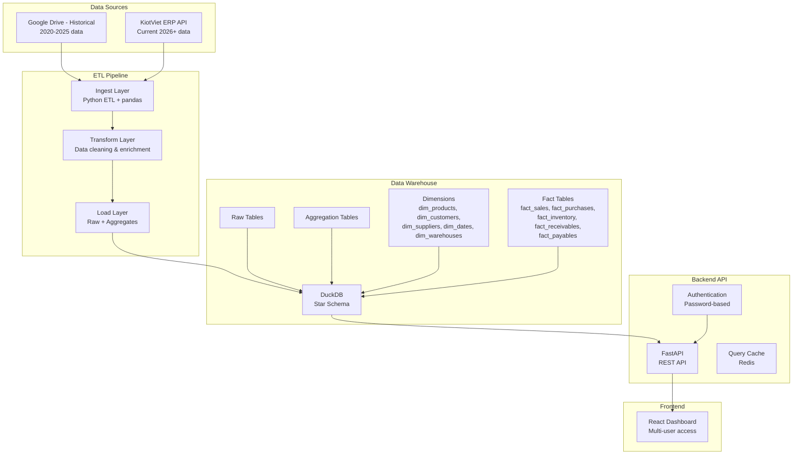

# feat: Data Engine for Tire Shop Business Dashboard

## Overview

Build a comprehensive data engine that powers a multi-user business dashboard for Nhan Thanh Tam tire shop. The engine ingests data from two sources:

1. **Google Drive** (historical data 2020-2025) - one-time migration
2. **KiotViet ERP API** (current data 2026+) - daily automated sync

Data flows through an ETL pipeline into DuckDB analytical database, exposing metrics via FastAPI REST API to a React dashboard.

**Architecture:**
```
Google Drive + KiotViet API → Python ETL → DuckDB → FastAPI → React Dashboard
```

**Dashboard Coverage:**
- Sales analytics (revenue, products, trends)
- Inventory health (stock levels, turnover)
- Receivables (aging, collections)
- Payables (aging, suppliers)
- Financial (margins, cash position)

**Deployment:** Local, multi-user, daily refresh

## Problem Statement / Motivation

### Current State
- Business data exists in two disconnected systems
  - Historical data (2020-2025): Google Drive spreadsheets (~450K transaction rows)
  - Current data (2026+): KiotViet ERP system
- No unified view for business decision-making
  - Cannot track trends across 2020-2026
  - Manual analysis required for any insights
  - No visibility into inventory health, aging metrics

### Why This Matters
- **Operational Visibility:** Real-time metrics for better inventory management and cash flow
- **Trend Analysis:** 6+ years of historical data enables long-term business insights
- **Multi-User Access:** Staff and management need simultaneous access to same data
- **Daily Freshness:** Daily sync ensures decisions based on current data

### Success Criteria
1. Historical 450K rows loaded into DuckDB with 99.9% accuracy
2. Daily KiotViet sync completes within 5 minutes with <1% error rate
3. Dashboard loads summary metrics in <2 seconds
4. Up to 5 concurrent users can query dashboard without timeout
5. Zero data loss during sync failures (retry mechanism)

## Proposed Solution

### High-Level Architecture



### Technology Stack

| Layer | Technology | Rationale |
|--------|------------|-----------|
| **Database** | DuckDB | Analytics-optimized, zero-config, handles 500K+ rows easily |
| **Backend** | FastAPI | Modern Python API, async support, auto-generated OpenAPI docs |
| **Frontend** | React 19 + TypeScript | Interactive dashboard, component reusability, strong typing |
| **State Management** | Zustand 5 | Lightweight, minimal boilerplate, built-in persistence |
| **Charts** | Recharts | Declarative, SVG-based, TypeScript support |
| **Tables** | TanStack Table + Virtual | Headless UI, virtualization for large datasets |
| **Real-time** | Polling (30s interval) | Simpler than WebSockets, sufficient for daily refresh |
| **Authentication** | Simple password (single-role) | Prototype phase, upgrade to OAuth if needed |
| **Rate Limiting** | fastapi-limiter | Per-user rate limiting, Redis backend |
| **Pagination** | fastapi-pagination | Type-safe pagination, multiple strategies |

## Technical Approach

### Architecture

#### 1. Data Model (Star Schema)

**Dimensions** (denormalized, SCD Type 2 for history tracking)

```sql
-- Products dimension with history
CREATE TABLE dim_products (
    product_key INTEGER PRIMARY KEY,
    product_code VARCHAR(50) NOT NULL UNIQUE,
    product_name VARCHAR(200),
    category VARCHAR(100),
    brand VARCHAR(100),
    tire_spec VARCHAR(100),
    price_cost DECIMAL(15,2),
    price_sell DECIMAL(15,2),
    valid_from TIMESTAMP NOT NULL,
    valid_to TIMESTAMP,
    is_current BOOLEAN DEFAULT true
);

-- Customers dimension
CREATE TABLE dim_customers (
    customer_key INTEGER PRIMARY KEY,
    customer_code VARCHAR(50) NOT NULL UNIQUE,
    customer_name VARCHAR(200),
    contact_person VARCHAR(100),
    phone VARCHAR(20),
    email VARCHAR(100),
    address TEXT,
    credit_limit DECIMAL(15,2),
    valid_from TIMESTAMP NOT NULL,
    valid_to TIMESTAMP,
    is_current BOOLEAN DEFAULT true
);

-- Suppliers dimension
CREATE TABLE dim_suppliers (
    supplier_key INTEGER PRIMARY KEY,
    supplier_code VARCHAR(50) NOT NULL UNIQUE,
    supplier_name VARCHAR(200),
    contact_person VARCHAR(100),
    phone VARCHAR(20),
    email VARCHAR(100),
    address TEXT,
    valid_from TIMESTAMP NOT NULL,
    valid_to TIMESTAMP,
    is_current BOOLEAN DEFAULT true
);

-- Date dimension (pre-populated 2020-2030)
CREATE TABLE dim_dates (
    date_key INTEGER PRIMARY KEY,  -- YYYYMMDD format
    full_date DATE NOT NULL,
    day INTEGER,
    month INTEGER,
    year INTEGER,
    quarter INTEGER,
    day_of_week INTEGER,
    day_name VARCHAR(10),
    month_name VARCHAR(10),
    is_weekend BOOLEAN,
    is_holiday BOOLEAN DEFAULT false
);

-- Warehouses dimension (single or multiple store locations)
CREATE TABLE dim_warehouses (
    warehouse_key INTEGER PRIMARY KEY,
    warehouse_code VARCHAR(50) NOT NULL UNIQUE,
    warehouse_name VARCHAR(200),
    location VARCHAR(200)
);
```

**Fact Tables** (transactional grain)

```sql
-- Sales fact (daily aggregated)
CREATE TABLE fact_sales (
    sales_key INTEGER PRIMARY KEY,
    date_key INTEGER NOT NULL,
    customer_key INTEGER NOT NULL,
    product_key INTEGER NOT NULL,
    warehouse_key INTEGER NOT NULL,
    quantity INTEGER NOT NULL,
    revenue DECIMAL(15,2) NOT NULL,
    cost DECIMAL(15,2),
    gross_margin DECIMAL(15,2),
    order_timestamp TIMESTAMP NOT NULL,
    FOREIGN KEY (date_key) REFERENCES dim_dates(date_key),
    FOREIGN KEY (customer_key) REFERENCES dim_customers(customer_key),
    FOREIGN KEY (product_key) REFERENCES dim_products(product_key),
    FOREIGN KEY (warehouse_key) REFERENCES dim_warehouses(warehouse_key)
);

-- Purchases fact
CREATE TABLE fact_purchases (
    purchase_key INTEGER PRIMARY KEY,
    date_key INTEGER NOT NULL,
    supplier_key INTEGER NOT NULL,
    product_key INTEGER NOT NULL,
    warehouse_key INTEGER NOT NULL,
    quantity INTEGER NOT NULL,
    total_cost DECIMAL(15,2) NOT NULL,
    order_timestamp TIMESTAMP NOT NULL,
    FOREIGN KEY (date_key) REFERENCES dim_dates(date_key),
    FOREIGN KEY (supplier_key) REFERENCES dim_suppliers(supplier_key),
    FOREIGN KEY (product_key) REFERENCES dim_products(product_key),
    FOREIGN KEY (warehouse_key) REFERENCES dim_warehouses(warehouse_key)
);

-- Inventory fact (daily snapshots)
CREATE TABLE fact_inventory (
    inventory_key INTEGER PRIMARY KEY,
    date_key INTEGER NOT NULL,
    product_key INTEGER NOT NULL,
    warehouse_key INTEGER NOT NULL,
    quantity_on_hand INTEGER NOT NULL,
    quantity_on_order INTEGER DEFAULT 0,
    quantity_reserved INTEGER DEFAULT 0,
    unit_cost DECIMAL(15,2),
    total_value DECIMAL(15,2),
    snapshot_timestamp TIMESTAMP NOT NULL,
    FOREIGN KEY (date_key) REFERENCES dim_dates(date_key),
    FOREIGN KEY (product_key) REFERENCES dim_products(product_key),
    FOREIGN KEY (warehouse_key) REFERENCES dim_warehouses(warehouse_key)
);

-- Receivables fact (daily tracking)
CREATE TABLE fact_receivables (
    receivable_key INTEGER PRIMARY KEY,
    date_key INTEGER NOT NULL,
    customer_key INTEGER NOT NULL,
    amount_billed DECIMAL(15,2) NOT NULL,
    amount_paid DECIMAL(15,2) DEFAULT 0,
    balance DECIMAL(15,2) GENERATED ALWAYS AS (amount_billed - amount_paid) STORED,
    days_outstanding INTEGER,
    aging_bucket VARCHAR(20),  -- 0-30, 31-60, 61-90, 90+
    invoice_date DATE,
    FOREIGN KEY (date_key) REFERENCES dim_dates(date_key),
    FOREIGN KEY (customer_key) REFERENCES dim_customers(customer_key)
);

-- Payables fact (daily tracking)
CREATE TABLE fact_payables (
    payable_key INTEGER PRIMARY KEY,
    date_key INTEGER NOT NULL,
    supplier_key INTEGER NOT NULL,
    amount_billed DECIMAL(15,2) NOT NULL,
    amount_paid DECIMAL(15,2) DEFAULT 0,
    balance DECIMAL(15,2) GENERATED ALWAYS AS (amount_billed - amount_paid) STORED,
    days_outstanding INTEGER,
    aging_bucket VARCHAR(20),  -- 0-30, 31-60, 61-90, 90+
    invoice_date DATE,
    FOREIGN KEY (date_key) REFERENCES dim_dates(date_key),
    FOREIGN KEY (supplier_key) REFERENCES dim_suppliers(supplier_key)
);
```

**Indexes** (for query performance)

```sql
CREATE INDEX idx_fact_sales_date ON fact_sales(date_key);
CREATE INDEX idx_fact_sales_customer ON fact_sales(customer_key);
CREATE INDEX idx_fact_sales_product ON fact_sales(product_key);
CREATE INDEX idx_fact_inventory_date ON fact_inventory(date_key);
CREATE INDEX idx_fact_inventory_product ON fact_inventory(product_key);
CREATE INDEX idx_fact_receivables_customer ON fact_receivables(customer_key);
CREATE INDEX idx_fact_receivables_date ON fact_receivables(date_key);
CREATE INDEX idx_fact_payables_supplier ON fact_payables(supplier_key);
CREATE INDEX idx_fact_payables_date ON fact_payables(date_key);
CREATE INDEX idx_dim_products_current ON dim_products(product_code, is_current);
CREATE INDEX idx_dim_customers_current ON dim_customers(customer_code, is_current);
```

#### 2. Aggregation Tables (Pre-computed for dashboard performance)

```sql
-- Daily sales aggregation
CREATE TABLE agg_sales_daily (
    date_key INTEGER NOT NULL,
    product_key INTEGER,
    category VARCHAR(100),
    total_quantity INTEGER,
    total_revenue DECIMAL(15,2),
    total_cost DECIMAL(15,2),
    gross_margin DECIMAL(15,2),
    order_count INTEGER,
    PRIMARY KEY (date_key, product_key),
    FOREIGN KEY (date_key) REFERENCES dim_dates(date_key)
);

-- Monthly sales aggregation
CREATE TABLE agg_sales_monthly (
    month_key INTEGER NOT NULL,  -- YYYYMM format
    product_key INTEGER,
    category VARCHAR(100),
    total_quantity INTEGER,
    total_revenue DECIMAL(15,2),
    total_cost DECIMAL(15,2),
    gross_margin DECIMAL(15,2),
    order_count INTEGER,
    PRIMARY KEY (month_key, product_key)
);

-- Daily inventory aggregation
CREATE TABLE agg_inventory_daily (
    date_key INTEGER NOT NULL,
    product_key INTEGER,
    category VARCHAR(100),
    total_on_hand INTEGER,
    total_value DECIMAL(15,2),
    turnover_days INTEGER,
    PRIMARY KEY (date_key, product_key)
);

-- Receivables aging (current snapshot)
CREATE TABLE agg_receivables_aging (
    aging_bucket VARCHAR(20) NOT NULL,
    customer_count INTEGER,
    total_amount DECIMAL(15,2),
    percentage DECIMAL(5,2),
    updated_at TIMESTAMP DEFAULT CURRENT_TIMESTAMP
);

-- Payables aging (current snapshot)
CREATE TABLE agg_payables_aging (
    aging_bucket VARCHAR(20) NOT NULL,
    supplier_count INTEGER,
    total_amount DECIMAL(15,2),
    percentage DECIMAL(5,2),
    updated_at TIMESTAMP DEFAULT CURRENT_TIMESTAMP
);
```

#### 3. DuckDB Connection Management

**Thread-Safe Connection Pattern** (critical for concurrent dashboard users)

```python
# src/db/connection_pool.py
import duckdb
from contextlib import contextmanager
from threading import Lock

class DuckDBConnectionPool:
    def __init__(self, database_path: str = "data/warehouse.db"):
        self.database_path = database_path
        self.main_connection = duckdb.connect(database_path)
        self.lock = Lock()

    @contextmanager
    def get_connection(self):
        """Get thread-local connection for read operations."""
        with self.lock:
            conn = self.main_connection.cursor()
        try:
            yield conn
        finally:
            conn.close()

    @contextmanager
    def get_write_connection(self):
        """Get write connection for ETL operations (exclusive access)."""
        with self.lock:
            # Use main connection for writes (single-writer mode)
            yield self.main_connection

# Global pool instance
pool = DuckDBConnectionPool()
```

#### 4. Historical Data Ingestion (One-Time)

**Assumptions (addressing SpecFlow gaps):**
- Historical data mapping: Use product codes from Google Drive as `product_code` in KiotViet
- Create `dim_products` with `product_code` as natural key (unique across both systems)
- Keep all historical records, use `is_current` flag for current status

**Ingestion Flow:**

```python
# src/etl/historical_ingest.py
import duckdb
from src.db.connection_pool import pool

def ingest_historical_data():
    """Ingest all Google Drive historical data into DuckDB."""

    # 1. Download all year/month files from Google Drive
    # Reuses existing src.modules.ingest.py patterns
    files = download_all_year_month_files()  # Returns 60+ XLSX paths

    # 2. Parse CT.NHAP, CT.XUAT, XNT tabs from each file
    all_sales = []
    all_purchases = []
    all_inventory = []

    for file_path in files:
        sales_df = parse_xlsx_tab(file_path, "CT.XUAT")
        purchases_df = parse_xlsx_tab(file_path, "CT.NHAP")
        inventory_df = parse_xlsx_tab(file_path, "XNT")

        all_sales.append(sales_df)
        all_purchases.append(purchases_df)
        all_inventory.append(inventory_df)

    # 3. Transform and merge dimensions
    products_df = build_product_dimensions(all_sales, all_purchases, all_inventory)
    customers_df = build_customer_dimensions(all_sales)
    suppliers_df = build_supplier_dimensions(all_purchases)

    # 4. Load into DuckDB using COPY for bulk insert
    with pool.get_write_connection() as conn:
        # Load raw data to staging tables first
        conn.execute("""
            COPY dim_products FROM 'products.csv' (DELIMITER ',', HEADER, FORMAT CSV);
            COPY dim_customers FROM 'customers.csv' (DELIMITER ',', HEADER, FORMAT CSV);
            COPY dim_suppliers FROM 'suppliers.csv' (DELIMITER ',', HEADER, FORMAT CSV);
            COPY fact_sales FROM 'sales.csv' (DELIMITER ',', HEADER, FORMAT CSV);
            COPY fact_purchases FROM 'purchases.csv' (DELIMITER ',', HEADER, FORMAT CSV);
            COPY fact_inventory FROM 'inventory.csv' (DELIMITER ',', HEADER, FORMAT CSV);
        """)

        # Create surrogate keys for fact tables
        conn.execute("""
            INSERT INTO dim_products (product_code, product_name, category, ...)
            SELECT product_code, product_name, category, ...
            FROM staging_products
            ON CONFLICT (product_code) DO UPDATE SET ...;
        """)

    # 5. Build aggregations
    refresh_all_aggregations(conn)

    # 6. Run ANALYZE for query optimization
    conn.execute("ANALYZE")

    return {
        "sales_rows": len(all_sales),
        "products": len(products_df),
        "customers": len(customers_df),
        "status": "completed"
    }
```

#### 5. KiotViet API Integration (Daily Sync)

**Authentication Strategy** (based on research findings):

```python
# src/etl/kiotviet_client.py
import requests
import time
from datetime import datetime, timedelta

class KiotVietClient:
    def __init__(self, client_id: str, client_secret: str, retailer_name: str):
        self.client_id = client_id
        self.client_secret = client_secret
        self.retailer_name = retailer_name
        self.token_url = "https://id.kiotviet.vn/connect/token"
        self.base_url = "https://public.kiotapi.com"
        self._token = None
        self._expires_at = None
        self.api_delay = 0.5  # 500ms between calls (research-based)

    def _get_token(self) -> str:
        """Get valid access token, refresh if expired."""
        if self._is_token_valid():
            return self._token
        return self._refresh_token()

    def _is_token_valid(self) -> bool:
        """Check if token is valid with 60s buffer."""
        if not self._token or not self._expires_at:
            return False
        return self._expires_at - time.time() > 60

    def _refresh_token(self) -> str:
        """Fetch new access token (OAuth 2.0 client credentials)."""
        response = requests.post(
            self.token_url,
            data={
                "grant_type": "client_credentials",
                "client_id": self.client_id,
                "client_secret": self.client_secret,
                "scopes": "PublicApi.Access"
            },
            headers={"Content-Type": "application/x-www-form-urlencoded"}
        )

        if response.status_code != 200:
            raise Exception(f"Failed to get token: {response.text}")

        data = response.json()
        self._token = data["access_token"]
        self._expires_at = time.time() + data["expires_in"] - 60
        return self._token

    def _make_request(self, method: str, endpoint: str, params=None, data=None):
        """Make authenticated API request with rate limiting."""
        time.sleep(self.api_delay)

        headers = {
            "Authorization": f"Bearer {self._get_token()}",
            "Retailer": self.retailer_name,
            "Content-Type": "application/json"
        }

        url = f"{self.base_url}/{endpoint}"
        response = requests.request(method, url, headers=headers, params=params, json=data, timeout=30)

        return self._handle_response(response)

    def _handle_response(self, response):
        """Handle API response with proper error handling."""
        if response.status_code == 200:
            return response.json()
        elif response.status_code == 429:
            # Rate limit exceeded - wait and retry
            retry_after = int(response.headers.get('Retry-After', 1))
            time.sleep(retry_after)
            return self._make_request(...)  # Retry
        elif response.status_code == 401:
            # Auth error - refresh token and retry
            self._refresh_token()
            return self._make_request(...)  # Retry
        else:
            raise Exception(f"API Error {response.status_code}: {response.text}")

    def get_products(self, last_modified_from: datetime = None, page_size: int = 100):
        """Fetch products with pagination, optionally incremental."""
        all_products = []
        current_item = 0

        while True:
            params = {
                "pageSize": page_size,
                "currentItem": current_item,
                "includeInventory": "true",
                "includePricebook": "true"
            }

            if last_modified_from:
                params["lastModifiedFrom"] = last_modified_from.isoformat()

            response = self._make_request("GET", "products", params=params)
            products = response.get('data', [])
            all_products.extend(products)

            if len(products) < page_size:
                break  # Last page

            current_item += page_size

        return all_products

    def get_customers(self, last_modified_from: datetime = None):
        """Fetch customers with incremental sync."""
        params = {}
        if last_modified_from:
            params["lastModifiedFrom"] = last_modified_from.isoformat()

        response = self._make_request("GET", "customers", params=params)
        return response.get('data', [])

    def get_invoices(self, from_date: str, to_date: str):
        """Fetch invoices by date range."""
        return self._make_request(
            "GET",
            f"invoices/byDateRange",
            params={"fromDate": from_date, "toDate": to_date}
        )
```

**Incremental Sync Pattern:**

```python
# src/etl/kiotviet_sync.py
import duckdb
from datetime import datetime
from src.db.connection_pool import pool
from src.etl.kiotviet_client import KiotVietClient

def sync_kiotviet_incremental():
    """Perform daily incremental sync from KiotViet API."""

    # 1. Load last sync timestamp from manifest table
    with pool.get_connection() as conn:
        last_sync = conn.execute("""
            SELECT MAX(sync_timestamp)
            FROM sync_manifest
            WHERE source = 'kiotviet'
        """).fetchone()[0]

    # 2. Initialize KiotViet client
    client = KiotVietClient(
        client_id=os.getenv("KIOTVIET_CLIENT_ID"),
        client_secret=os.getenv("KIOTVIET_CLIENT_SECRET"),
        retailer_name=os.getenv("KIOTVIET_RETAILER_NAME")
    )

    # 3. Fetch incremental updates
    last_sync_date = last_sync or datetime(2026, 1, 1)

    products = client.get_products(last_modified_from=last_sync_date)
    customers = client.get_customers(last_modified_from=last_sync_date)

    # 4. Upsert into DuckDB using MERGE (SCD Type 2)
    with pool.get_write_connection() as conn:
        # Upsert products with history
        conn.execute("""
            MERGE INTO dim_products AS target
            USING incoming_products AS source
            ON target.product_code = source.product_code AND target.is_current = true

            WHEN MATCHED AND (
                   target.product_name <> source.product_name OR
                   target.category <> source.category OR
                   target.price_sell <> source.price_sell
            ) THEN UPDATE SET
                valid_to = CURRENT_TIMESTAMP - INTERVAL '1 second',
                is_current = false

            WHEN NOT MATCHED BY TARGET THEN INSERT (
                product_code, product_name, category, price_sell,
                valid_from, valid_to, is_current
            ) VALUES (
                source.product_code, source.product_name, source.category, source.price_sell,
                CURRENT_TIMESTAMP, NULL, true
            )

            WHEN NOT MATCHED BY SOURCE AND target.is_current = true THEN UPDATE SET
                valid_to = CURRENT_TIMESTAMP - INTERVAL '1 second',
                is_current = false

            RETURNING merge_action, *;
        """)

        # Similar MERGE for customers, suppliers

    # 5. Refresh aggregations for affected date ranges
    refresh_daily_aggregations(conn, date_from=last_sync_date)

    # 6. Update sync manifest
    with pool.get_write_connection() as conn:
        conn.execute("""
            INSERT INTO sync_manifest (source, sync_timestamp, status)
            VALUES ('kiotviet', CURRENT_TIMESTAMP, 'completed')
        """)

    return {"status": "completed", "last_sync": datetime.now()}

def refresh_daily_aggregations(conn, date_from: datetime):
    """Refresh aggregations for affected date range."""
    # Rebuild daily sales aggregation
    conn.execute("""
        INSERT OR REPLACE INTO agg_sales_daily
        SELECT
            date_key,
            product_key,
            category,
            SUM(quantity) AS total_quantity,
            SUM(revenue) AS total_revenue,
            SUM(cost) AS total_cost,
            SUM(gross_margin) AS gross_margin,
            COUNT(*) AS order_count
        FROM fact_sales
        WHERE order_timestamp >= ?
        GROUP BY date_key, product_key, category
    """, [date_from])

    # Rebuild receivables aging
    conn.execute("""
        DELETE FROM agg_receivables_aging;

        INSERT INTO agg_receivables_aging
        SELECT
            aging_bucket,
            COUNT(DISTINCT customer_key) AS customer_count,
            SUM(balance) AS total_amount,
            100.0 * SUM(balance) / (SELECT SUM(balance) FROM fact_receivables) AS percentage
        FROM (
            SELECT
                customer_key,
                balance,
                CASE
                    WHEN days_outstanding <= 30 THEN '0-30'
                    WHEN days_outstanding <= 60 THEN '31-60'
                    WHEN days_outstanding <= 90 THEN '61-90'
                    ELSE '90+'
                END AS aging_bucket
            FROM fact_receivables
        ) x
        GROUP BY aging_bucket
    """)
```

#### 6. FastAPI Backend

**API Structure:**

```python
# src/api/main.py
from fastapi import FastAPI, Depends, HTTPException, status
from fastapi.middleware.cors import CORSMiddleware
from src.db.connection_pool import pool
from src.api.routes import sales, inventory, receivables, payables, financial

app = FastAPI(
    title="Tire Shop Data Engine API",
    description="REST API for tire shop business dashboard",
    version="1.0.0"
)

# CORS middleware for React dashboard
app.add_middleware(
    CORSMiddleware,
    allow_origins=["http://localhost:3000"],
    allow_credentials=True,
    allow_methods=["*"],
    allow_headers=["*"],
)

# Include API routers
app.include_router(sales.router, prefix="/api/v1/sales", tags=["sales"])
app.include_router(inventory.router, prefix="/api/v1/inventory", tags=["inventory"])
app.include_router(receivables.router, prefix="/api/v1/receivables", tags=["receivables"])
app.include_router(payables.router, prefix="/api/v1/payables", tags=["payables"])
app.include_router(financial.router, prefix="/api/v1/financial", tags=["financial"])

# Health check
@app.get("/health")
def health_check():
    return {"status": "healthy"}

# Authentication dependency (simple password for prototype)
def verify_password(password: str = Depends(HTTPBearer())):
    """Verify dashboard access password."""
    if password.credentials != os.getenv("DASHBOARD_PASSWORD"):
        raise HTTPException(
            status_code=status.HTTP_401_UNAUTHORIZED,
            detail="Invalid password"
        )
    return True
```

**Sales Routes Example:**

```python
# src/api/routes/sales.py
from fastapi import APIRouter, Depends, Query
from fastapi_pagination import Page, add_pagination
from pydantic import BaseModel
from typing import Optional
from datetime import date

router = APIRouter()

class SalesSummaryResponse(BaseModel):
    date: date
    total_revenue: float
    total_quantity: int
    order_count: int
    gross_margin: float

@router.get("/summary", response_model=Page[SalesSummaryResponse])
async def get_sales_summary(
    from_date: date = Query(...),
    to_date: date = Query(...),
    category: Optional[str] = None,
    conn = Depends(pool.get_connection)
):
    """Get daily sales summary with pagination."""
    query = """
        SELECT
            d.full_date AS date,
            SUM(s.revenue) AS total_revenue,
            SUM(s.quantity) AS total_quantity,
            COUNT(*) AS order_count,
            SUM(s.gross_margin) AS gross_margin
        FROM fact_sales s
        JOIN dim_dates d ON s.date_key = d.date_key
        WHERE d.full_date BETWEEN ? AND ?
    """

    params = [from_date, to_date]

    if category:
        query += " AND s.product_key IN (SELECT product_key FROM dim_products WHERE category = ?)"
        params.append(category)

    query += " GROUP BY d.full_date ORDER BY d.full_date DESC"

    # Execute query and return as page
    result = conn.execute(query, params).df()
    return paginate(result)

@router.get("/top-products")
async def get_top_products(
    from_date: date = Query(...),
    to_date: date = Query(...),
    limit: int = Query(10, le=50),
    conn = Depends(pool.get_connection)
):
    """Get top N products by revenue in date range."""
    result = conn.execute("""
        SELECT
            p.product_code,
            p.product_name,
            p.category,
            SUM(s.quantity) AS total_quantity,
            SUM(s.revenue) AS total_revenue,
            SUM(s.gross_margin) AS total_margin
        FROM fact_sales s
        JOIN dim_products p ON s.product_key = p.product_key
        JOIN dim_dates d ON s.date_key = d.date_key
        WHERE d.full_date BETWEEN ? AND ?
        GROUP BY p.product_key, p.product_name, p.category
        ORDER BY total_revenue DESC
        LIMIT ?
    """, [from_date, to_date, limit]).df()

    return {"products": result.to_dict(orient="records")}
```

#### 7. React Dashboard

**Project Structure:**

```
src/
├── features/
│   ├── dashboard/
│   │   ├── components/
│   │   │   ├── SalesChart.tsx
│   │   │   ├── InventoryTable.tsx
│   │   │   ├── ReceivablesAging.tsx
│   │   │   └── FinancialSummary.tsx
│   │   ├── hooks/
│   │   │   ├── useDashboardData.ts
│   │   │   └── usePolling.ts
│   │   ├── stores/
│   │   │   └── dashboardStore.ts
│   │   └── Dashboard.tsx
│   └── sales/
│       ├── components/
│       └── hooks/
├── components/
│   ├── ui/
│   │   ├── Button.tsx
│   │   ├── Card.tsx
│   │   └── DatePicker.tsx
└── App.tsx
```

**Dashboard Store (Zustand 5):**

```typescript
// src/features/dashboard/stores/dashboardStore.ts
import { create } from 'zustand';
import { persist } from 'zustand/middleware';
import { useShallow } from 'zustand/react/shallow';

interface DashboardStore {
  // Data
  summary: DashboardSummary | null;
  loading: boolean;
  error: string | null;
  lastUpdated: Date | null;

  // Filters
  dateRange: DateRange;
  categoryFilter: string | null;

  // Actions
  setSummary: (summary: DashboardSummary) => void;
  setDateRange: (range: DateRange) => void;
  setLoading: (loading: boolean) => void;
  setError: (error: string | null) => void;
  updateLastSync: (timestamp: Date) => void;
}

interface DashboardSummary {
  totalRevenue: number;
  totalSales: number;
  inventoryValue: number;
  receivablesTotal: number;
  payablesTotal: number;
  grossMargin: number;
}

const useDashboardStore = create<DashboardStore>()(
  persist(
    (set) => ({
      summary: null,
      loading: false,
      error: null,
      lastUpdated: null,
      dateRange: {
        from: new Date('2026-01-01'),
        to: new Date()
      },
      categoryFilter: null,

      setSummary: (summary) => set({ summary }),
      setDateRange: (dateRange) => set({ dateRange }),
      setLoading: (loading) => set({ loading }),
      setError: (error) => set({ error }),
      updateLastSync: (timestamp) => set({ lastUpdated: timestamp }),
    }),
    { name: 'dashboard-storage' }
  )
);

// Select specific fields to prevent unnecessary re-renders
export const useDashboardData = () => useDashboardStore(
  useShallow((state) => ({
    summary: state.summary,
    loading: state.loading,
    error: state.error,
    lastUpdated: state.lastUpdated,
    dateRange: state.dateRange,
    categoryFilter: state.categoryFilter,
  }))
);

export const useDashboardActions = () => useDashboardStore(
  useShallow((state) => ({
    setSummary: state.setSummary,
    setDateRange: state.setDateRange,
    setLoading: state.setLoading,
    setError: state.setError,
    updateLastSync: state.updateLastSync,
  }))
);

export default useDashboardStore;
```

**Dashboard Component:**

```typescript
// src/features/dashboard/Dashboard.tsx
"use client";

import { useEffect } from 'react';
import { useDashboardData, useDashboardActions } from './stores/dashboardStore';
import { usePolling } from './hooks/usePolling';
import SalesChart from './components/SalesChart';
import InventoryTable from './components/InventoryTable';
import ReceivablesAging from './components/ReceivablesAging';
import FinancialSummary from './components/FinancialSummary';

export default function Dashboard() {
  const { summary, loading, error, lastUpdated, dateRange } = useDashboardData();
  const { setSummary, setLoading, setError, updateLastSync } = useDashboardActions();

  // Poll for data updates every 30 seconds
  const { refresh } = usePolling(30000, async () => {
    setLoading(true);
    try {
      const response = await fetch('/api/v1/dashboard/summary', {
        method: 'POST',
        headers: { 'Content-Type': 'application/json' },
        body: JSON.stringify(dateRange)
      });

      const data = await response.json();
      setSummary(data);
      updateLastSync(new Date());
    } catch (err) {
      setError('Failed to load dashboard data');
    } finally {
      setLoading(false);
    }
  });

  if (loading && !summary) {
    return <div className="loading-spinner">Loading...</div>;
  }

  if (error) {
    return <div className="error-message">{error}</div>;
  }

  return (
    <div className="dashboard">
      <header>
        <h1>Tire Shop Dashboard</h1>
        <button onClick={refresh}>Refresh Now</button>
        <span>Last updated: {lastUpdated?.toLocaleString()}</span>
      </header>

      <FinancialSummary summary={summary} />

      <div className="metrics-grid">
        <SalesChart summary={summary} />
        <InventoryTable />
        <ReceivablesAging />
      </div>
    </div>
  );
}
```

**Polling Hook:**

```typescript
// src/features/dashboard/hooks/usePolling.ts
import { useEffect, useRef } from 'react';

export function usePolling(interval: number, callback: () => Promise<void>) {
  const timerRef = useRef<NodeJS.Timeout | null>(null);

  useEffect(() => {
    // Execute callback immediately on mount
    callback();

    // Set up polling interval
    timerRef.current = setInterval(callback, interval);

    // Cleanup on unmount
    return () => {
      if (timerRef.current) {
        clearInterval(timerRef.current);
      }
    };
  }, [interval, callback]);

  return {
    refresh: () => callback()
  };
}
```

### Implementation Phases

#### Phase 1: Foundation (Week 1-2)

**Goal:** Set up infrastructure and database schema.

**Tasks:**

1. **Environment Setup**
   - [ ] Install DuckDB, FastAPI, React 19, TypeScript
   - [ ] Configure Python virtual environment with dependencies
   - [ ] Set up Node.js environment for React
   - [ ] Create `.env` file for secrets (KiotViet credentials, dashboard password)

2. **DuckDB Database Schema**
   - [ ] Create `src/db/schema.sql` with all CREATE TABLE statements
   - [ ] Implement `DuckDBConnectionPool` in `src/db/connection_pool.py`
   - [ ] Create `dim_dates` table and pre-populate 2020-2030 dates
   - [ ] Add all indexes for performance
   - [ ] Write unit tests for connection pool

3. **Configuration**
   - [ ] Update `pipeline.toml` with new sections:
     - `[database]`: DuckDB path, backup settings
     - `[kiotviet]`: API credentials, retailer name
     - `[dashboard]`: FastAPI host/port, React build path
     - `[sync]`: Daily sync schedule, email alerts
   - [ ] Create `sync_manifest` table schema for tracking sync state

4. **Testing Infrastructure**
   - [ ] Set up pytest with DuckDB test database (`:memory:`)
   - [ ] Create test fixtures for sample data
   - [ ] Mock KiotViet API in tests

**Success Criteria:**
- DuckDB schema creates successfully with all tables and indexes
- Connection pool handles concurrent reads correctly
- Tests pass for basic CRUD operations

**Estimated Effort:** 40 hours

#### Phase 2: Historical Data Ingestion (Week 2-3)

**Goal:** Migrate all Google Drive data to DuckDB.

**Tasks:**

1. **Google Drive Ingestion Enhancement**
   - [ ] Enhance `src/modules/ingest.py` to support full download
   - [ ] Download all 60+ monthly XLSX files from 2020-2025
   - [ ] Download receivable and payable spreadsheets
   - [ ] Store in `data/00-raw/historical/` directory

2. **Data Transformation**
   - [ ] Create `src/etl/transform_historical.py`
   - [ ] Parse CT.NHAP, CT.XUAT, XNT tabs from XLSX files
   - [ ] Transform to match DuckDB schema (column mapping, data types)
   - [ ] Handle Vietnamese text encoding (`# -*- coding: utf-8 -*-`)
   - [ ] Clean and normalize data (remove duplicates, fix dates)

3. **Dimension Building**
   - [ ] Build `dim_products` from sales/purchases/inventory data
   - [ ] Build `dim_customers` from sales and receivable data
   - [ ] Build `dim_suppliers` from purchases and payable data
   - [ ] Resolve duplicates (same product/customer with different codes)

4. **Data Loading**
   - [ ] Use DuckDB `COPY` statement for bulk loading (NOT row-by-row INSERT)
   - [ ] Load raw tables first
   - [ ] Apply SCD Type 2 for dimensions (history tracking)
   - [ ] Build fact tables with surrogate keys

5. **Validation**
   - [ ] Check referential integrity (all FKs valid)
   - [ ] Validate data quality (no null critical fields, positive quantities)
   - [ ] Compare row counts to source files
   - [ ] Generate validation report

**Success Criteria:**
- All 450K transaction rows loaded with 99.9% accuracy
- All dimensions populated correctly
- Validation report shows <0.1% data quality issues

**Estimated Effort:** 60 hours

#### Phase 3: KiotViet API Integration (Week 3-4)

**Goal:** Set up daily automated sync from KiotViet.

**Tasks:**

1. **KiotViet API Client**
   - [ ] Create `src/etl/kiotviet_client.py`
   - [ ] Implement OAuth 2.0 client credentials flow
   - [ ] Add token caching with 60s buffer before refresh
   - [ ] Implement rate limiting (500ms delay between calls)
   - [ ] Add retry logic with exponential backoff on 429 errors
   - [ ] Handle all error codes (400, 401, 403, 404, 500)

2. **API Endpoint Implementation**
   - [ ] Implement `get_products()` with pagination (max 100 items/page)
   - [ ] Implement `get_customers()` with incremental sync (`lastModifiedFrom`)
   - [ ] Implement `get_invoices()` by date range
   - [ ] Implement `get_suppliers()` and `get_inventory()` endpoints

3. **Incremental Sync Pipeline**
   - [ ] Create `src/etl/kiotviet_sync.py`
   - [ ] Load last sync timestamp from `sync_manifest` table
   - [ ] Fetch incremental updates from KiotViet API
   - [ ] Upsert into DuckDB using `MERGE` statement (SCD Type 2)
   - [ ] Handle deleted records (KiotViet provides `removeId` array)

4. **Aggregation Refresh**
   - [ ] Refresh `agg_sales_daily` for affected dates
   - [ ] Refresh `agg_sales_monthly` if crossing month boundary
   - [ ] Refresh `agg_receivables_aging` and `agg_payables_aging`
   - [ ] Run `ANALYZE` after sync completes

5. **Automation**
   - [ ] Create daily sync cron job (run at 2 AM)
   - [ ] Add logging for sync status
   - [ ] Send email alert on sync failure
   - [ ] Implement retry logic (3 attempts with 1-hour backoff)

**Success Criteria:**
- Daily sync completes within 5 minutes
- Error rate <1%
- Token refresh works automatically
- Handles rate limits gracefully

**Estimated Effort:** 50 hours

#### Phase 4: FastAPI Backend (Week 4-5)

**Goal:** Build REST API for dashboard data queries.

**Tasks:**

1. **FastAPI Application Setup**
   - [ ] Create `src/api/main.py` with FastAPI app
   - [ ] Add CORS middleware for React (localhost:3000)
   - [ ] Configure uvicorn with 4 workers
   - [ ] Add health check endpoint `/health`

2. **Authentication**
   - [ ] Implement simple password verification in `src/api/auth.py`
   - [ ] Create HTTPBearer dependency for protected routes
   - [ ] Store password in environment variable (`DASHBOARD_PASSWORD`)
   - [ ] Add OpenAPI documentation for auth

3. **API Routes**
   - [ ] Create `src/api/routes/sales.py`
     - [ ] `GET /api/v1/sales/summary` (daily revenue, quantity, margin)
     - [ ] `GET /api/v1/sales/top-products` (top N by revenue)
     - [ ] `GET /api/v1/sales/by-category` (category breakdown)
   - [ ] Create `src/api/routes/inventory.py`
     - [ ] `GET /api/v1/inventory/stock-levels` (current stock, reorder alerts)
     - [ ] `GET /api/v1/inventory/turnover` (turnover days, slow-moving items)
   - [ ] Create `src/api/routes/receivables.py`
     - [ ] `GET /api/v1/receivables/aging` (aging buckets by customer)
     - [ ] `GET /api/v1/receivables/summary` (total outstanding, collection trends)
   - [ ] Create `src/api/routes/payables.py`
     - [ ] `GET /api/v1/payables/aging` (aging buckets by supplier)
     - [ ] `GET /api/v1/payables/summary` (total outstanding, payment schedule)
   - [ ] Create `src/api/routes/financial.py`
     - [ ] `GET /api/v1/financial/summary` (cash position, working capital, P&L)
     - [ ] `GET /api/v1/financial/profitability` (gross margin by category)

4. **Pagination**
   - [ ] Install `fastapi-pagination`
   - [ ] Add pagination to all list endpoints
   - [ ] Use Page-based pagination (page, size)
   - [ ] Return metadata (total, pages)

5. **Query Optimization**
   - [ ] Use DuckDB connection from pool for all queries
   - [ ] Add proper indexing (already in schema)
   - [ ] Optimize queries (filter early, join after filter)
   - [ ] Add query logging for slow query detection

**Success Criteria:**
- All endpoints respond in <500ms for typical queries
- OpenAPI docs generated at `/docs`
- Authentication works correctly
- Pagination handles large datasets (>1000 rows)

**Estimated Effort:** 45 hours

#### Phase 5: React Dashboard (Week 5-7)

**Goal:** Build interactive multi-user dashboard.

**Tasks:**

1. **Project Setup**
   - [ ] Initialize React 19 project with TypeScript (Vite)
   - [ ] Install dependencies: Zustand 5, Recharts, TanStack Table, Tailwind CSS 4
   - [ ] Configure Tailwind CSS with theme variables
   - [ ] Set up Vite dev server (localhost:3000)

2. **State Management**
   - [ ] Create `src/features/dashboard/stores/dashboardStore.ts` (Zustand)
   - [ ] Add persist middleware for user preferences
   - [ ] Create slices for different features (sales, inventory, receivables, payables, financial)
   - [ ] Implement selectors to prevent unnecessary re-renders

3. **UI Components**
   - [ ] Create reusable components in `src/components/ui/`:
     - [ ] `Button.tsx`
     - [ ] `Card.tsx`
     - [ ] `DatePicker.tsx`
     - [ ] `LoadingSpinner.tsx`
     - [ ] `ErrorMessage.tsx`
   - [ ] Apply Tailwind CSS 4 styling (use `cn()` utility for merging)

4. **Dashboard Components**
   - [ ] Create `SalesChart.tsx` (Recharts line/bar chart)
     - [ ] Display daily/monthly revenue trend
     - [ ] Show category breakdown
   - [ ] Create `InventoryTable.tsx` (TanStack Table + Virtual)
     - [ ] Show current stock levels
     - [ ] Add reorder alerts (quantity < threshold)
     - [ ] Virtualize for 1000+ products
   - [ ] Create `ReceivablesAging.tsx` (stacked bar chart + table)
     - [ ] Show aging buckets (0-30, 31-60, 61-90, 90+)
     - [ ] List customers by bucket
   - [ ] Create `FinancialSummary.tsx` (key metrics cards)
     - [ ] Total revenue, inventory value, receivables, payables, working capital

5. **Data Fetching**
   - [ ] Create `src/features/dashboard/hooks/useDashboardData.ts`
   - [ ] Implement polling hook (`usePolling`) for 30-second intervals
   - [ ] Add error handling (retry on failure, show error message)
   - [ ] Show loading states and "last updated" timestamp

6. **Authentication**
   - [ ] Create login page at `/login`
   - [ ] Implement simple password form
   - [ ] Store auth token in httpOnly cookie
   - [ ] Redirect to dashboard on success
   - [ ] Add logout button

7. **Routing**
   - [ ] Set up React Router with routes:
     - [ ] `/login` - Login page
     - [ ] `/dashboard` - Main dashboard
     - [ ] `/sales` - Sales analytics page
     - [ ] `/inventory` - Inventory management page
     - [ ] `/receivables` - Receivables page
     - [ ] `/payables` - Payables page
     - [ ] `/financial` - Financial metrics page
   - [ ] Add protected route wrapper (redirect to /login if not authenticated)

8. **Responsiveness**
   - [ ] Test dashboard on desktop (1920x1080)
   - [ ] Test on tablet (768x1024)
   - [ ] Test on mobile (375x667) - optimize if needed

9. **Build & Deploy**
   - [ ] Build React app: `npm run build`
   - [ ] Configure FastAPI to serve static files from `dist/`
   - [ ] Test production build locally
   - [ ] Document build process

**Success Criteria:**
- Dashboard loads in <2 seconds
- All charts render correctly with real data
- Multi-user access works (5 concurrent users)
- Authentication prevents unauthorized access

**Estimated Effort:** 80 hours

#### Phase 6: Testing & Quality Assurance (Week 7)

**Goal:** Ensure system works correctly and handles errors.

**Tasks:**

1. **Unit Tests**
   - [ ] Write tests for `DuckDBConnectionPool`
   - [ ] Write tests for `KiotVietClient` (mock API calls)
   - [ ] Write tests for ETL transformation functions
   - [ ] Write tests for FastAPI endpoints (using TestClient)
   - [ ] Achieve 80%+ code coverage

2. **Integration Tests**
   - [ ] Test historical data ingestion end-to-end
   - [ ] Test KiotViet sync with real API (or mocked responses)
   - [ ] Test aggregation refresh after sync
   - [ ] Test concurrent dashboard queries (simulate 5 users)

3. **Load Testing**
   - [ ] Test with 450K rows historical data
   - [ ] Simulate 5 concurrent dashboard users
   - [ ] Measure query response times
   - [ ] Identify slow queries and optimize

4. **Error Handling Tests**
   - [ ] Test KiotViet API rate limit (simulate 429)
   - [ ] Test network timeout during sync
   - [ ] Test database connection failure
   - [ ] Test invalid authentication

5. **Data Validation**
   - [ ] Verify data accuracy (compare dashboard to source)
   - [ ] Check aggregations match raw data
   - [ ] Validate aging calculations
   - [ ] Check no data loss during sync

**Success Criteria:**
- All tests pass (pytest coverage >80%)
- Load test: 5 users, <2s response times
- Error handling tests: all edge cases covered
- Data accuracy: 99.9% match

**Estimated Effort:** 40 hours

#### Phase 7: Deployment & Operations (Week 8)

**Goal:** Deploy system locally and set up operations.

**Tasks:**

1. **Local Deployment Setup**
   - [ ] Create deployment script `scripts/deploy.sh`
   - [ ] Start DuckDB database
   - [ ] Start FastAPI with uvicorn: `uv run uvicorn src.api.main:app --host 0.0.0.0 --port 8000`
   - [ ] Serve React static files from FastAPI
   - [ ] Configure firewall rules (allow port 8000)

2. **Backup Strategy**
   - [ ] Create daily backup script `scripts/backup_db.sh`
   - [ ] Backup DuckDB database file to `data/backups/`
   - [ ] Keep 30 days of backups
   - [ ] Test restore process

3. **Monitoring**
   - [ ] Add logging to all components (ETL, API, dashboard)
   - [ ] Set up log rotation (keep 7 days)
   - [ ] Monitor CPU, RAM, disk usage
   - [ ] Create health check endpoint `/health`

4. **Documentation**
   - [ ] Write user manual: how to use dashboard
   - [ ] Write admin guide: how to configure, deploy, troubleshoot
   - [ ] Document API endpoints in OpenAPI (auto-generated by FastAPI)
   - [ ] Create troubleshooting guide (common errors and solutions)

5. **Automation**
   - [ ] Set up daily KiotViet sync cron job
   - [ ] Configure email alerts for sync failures
   - [ ] Set up log monitoring (grep for ERROR in logs)

**Success Criteria:**
- System runs 24/7 without manual intervention
- Daily sync completes automatically
- Backups created successfully
- Documentation enables self-service troubleshooting

**Estimated Effort:** 30 hours

## Alternative Approaches Considered

### Approach A: Modern Data Stack Lite (CHOSEN)
**Stack:** Python ETL → DuckDB → FastAPI → React Dashboard

**Pros:**
- Most flexible for future enhancements
- Good talent pool for React + FastAPI
- DuckDB handles 500K rows easily
- Clear separation of concerns
- Multi-user support built-in

**Cons:**
- More moving parts to maintain
- Requires knowledge of 4 languages (Python, SQL, TypeScript)
- Higher initial complexity

### Approach B: DuckDB + Evidence (Rejected)
**Stack:** SQL scripts → DuckDB → Evidence → Markdown/SQL

**Pros:**
- SQL-centric, minimal code
- Documentation-quality reports
- Fast development

**Cons:**
- Less interactive than React dashboard
- Harder to add custom UI
- Limited user experience
- Multi-user access requires additional layer

**Why Rejected:** User wants full dashboard with interactivity and multi-user access.

### Approach C: Streamlit + DuckDB (Rejected)
**Stack:** Python ETL → DuckDB → Streamlit → Web UI

**Pros:**
- Fastest to build
- Single Python codebase
- Simple deployment

**Cons:**
- Limited UI flexibility
- Streamlit performance issues with large datasets
- Less customizable for future features

**Why Rejected:** Streamlit limitations for complex dashboards with multiple user roles.

## Acceptance Criteria

### Functional Requirements

- [ ] **Historical Data Ingestion**
  - [ ] All 2020-2025 Google Drive data loaded into DuckDB
  - [ ] 450K+ transaction rows loaded with 99.9% accuracy
  - [ ] All dimensions (products, customers, suppliers) populated correctly
  - [ ] Validation report generated with <0.1% data quality issues

- [ ] **KiotViet API Integration**
  - [ ] OAuth 2.0 authentication with auto-refresh
  - [ ] Daily sync completes within 5 minutes
  - [ ] Error rate <1%
  - [ ] Rate limiting respected (500ms delay between calls)
  - [ ] Incremental sync using `lastModifiedFrom` parameter
  - [ ] Deleted records handled (via `removeId` array)

- [ ] **Database (DuckDB)**
  - [ ] Star schema implemented (5 dimensions, 5 fact tables)
  - [ ] Aggregation tables created (daily, monthly, aging)
  - [ ] Indexes on all foreign keys and frequently queried columns
  - [ ] Thread-safe connection pool for concurrent reads
  - [ ] `ANALYZE` run after data changes for query optimization

- [ ] **REST API (FastAPI)**
  - [ ] All endpoints respond in <500ms for typical queries
  - [ ] Pagination implemented (Page-based with metadata)
  - [ ] Simple password authentication for prototype
  - [ ] CORS configured for React (localhost:3000)
  - [ ] OpenAPI documentation available at `/docs`
  - [ ] Rate limiting per user (Redis backend)

- [ ] **Dashboard (React)**
  - [ ] Dashboard loads in <2 seconds
  - [ ] All 5 metric categories display correctly:
    - [ ] Sales analytics (revenue, products, trends)
    - [ ] Inventory health (stock levels, turnover)
    - [ ] Receivables (aging, collections)
    - [ ] Payables (aging, suppliers)
    - [ ] Financial (margins, cash position)
  - [ ] Multi-user support (5 concurrent users)
  - [ ] Auto-refresh every 30 seconds
  - [ ] Manual refresh button
  - [ ] Filter controls (date range, category, product)
  - [ ] Drill-down capability (summary → detail → transactions)
  - [ ] Export functionality (CSV for all data tables)

### Non-Functional Requirements

- [ ] **Performance**
  - [ ] Dashboard summary query <500ms
  - [ ] Daily sync completes <5 minutes
  - [ ] Virtualized tables handle 1000+ rows without lag
  - [ ] 5 concurrent users query without timeout

- [ ] **Reliability**
  - [ ] Zero data loss during sync failures (retry mechanism)
  - [ ] Graceful error handling (no crashes)
  - [ ] Database backups daily, keep 30 days
  - [ ] Automatic retry on API rate limits (429)

- [ ] **Usability**
  - [ ] Login page with simple password authentication
  - [ ] Responsive design (desktop, tablet, mobile)
  - [ ] Loading states and error messages displayed
  - [ ] "Last updated" timestamp visible
  - [ ] Vietnamese language support in data labels

- [ ] **Security**
  - [ ] Dashboard password protected (environment variable)
  - [ ] API rate limiting prevents abuse
  - [ ] No sensitive data logged (passwords, tokens)
  - [ ] httpOnly cookies for auth (no localStorage)

### Quality Gates

- [ ] **Testing**
  - [ ] Pytest coverage >80%
  - [ ] All unit tests pass
  - [ ] Integration tests cover critical flows (ingestion, sync, API queries)
  - [ ] Load test with 5 concurrent users

- [ ] **Code Quality**
  - [ ] Ruff linting passes (`ruff check .`)
  - [ ] Ruff formatting applied (`ruff format .`)
  - [ ] TypeScript strict mode enabled
  - [ ] No `any` types (use proper interfaces)

- [ ] **Documentation**
  - [ ] User manual for dashboard usage
  - [ ] Admin guide for deployment and configuration
  - [ ] API documentation (OpenAPI auto-generated)
  - [ ] Troubleshooting guide for common errors

## Success Metrics

| Metric | Target | Measurement Method |
|--------|---------|-------------------|
| **Data Ingestion Speed** | 450K rows loaded in <30 minutes | Historical load job logs |
| **Daily Sync Duration** | <5 minutes | Sync job logs |
| **Dashboard Load Time** | <2 seconds | Browser DevTools Network tab |
| **Query Response Time** | <500ms (95th percentile) | API logs + browser timing |
| **Concurrent User Support** | 5 users without timeout | Load testing with k6 or Locust |
| **Data Accuracy** | 99.9% match between source and dashboard | Validation scripts compare DuckDB to source |
| **Error Rate** | <1% (sync failures / total syncs) | Sync job logs |
| **System Uptime** | 99% (except maintenance windows) | Monitoring logs |
| **Test Coverage** | >80% | pytest coverage report |

## Dependencies & Prerequisites

### External Dependencies

| Dependency | Version | Purpose | Setup Required |
|-------------|---------|---------|----------------|
| **DuckDB** | Latest | Analytical database | `pip install duckdb` |
| **FastAPI** | 0.104+ | REST API framework | `pip install fastapi uvicorn` |
| **Pytest** | 9.0+ | Testing framework | Already installed |
| **Ruff** | 0.14+ | Linting/formatting | Already installed |
| **React** | 19.0+ | Frontend framework | `npm create vite@latest` |
| **TypeScript** | 5.0+ | Type safety | Built into Vite React template |
| **Zustand** | 5.0+ | State management | `npm install zustand` |
| **Recharts** | Latest | Charts | `npm install recharts` |
| **TanStack Table** | Latest | Virtualized tables | `npm install @tanstack/react-table @tanstack/react-virtual` |
| **Tailwind CSS** | 4.0+ | Styling | `npm install tailwindcss` |
| **fastapi-pagination** | Latest | Pagination | `pip install fastapi-pagination` |
| **fastapi-limiter** | Latest | Rate limiting | `pip install fastapi-limiter redis` |
| **Redis** | Latest | Rate limiting backend | `docker run redis` or `brew install redis` |

### Internal Dependencies

- **Current ETL Pipeline:** Reuse transformation patterns from `src/modules/`
- **Data Schema:** KiotViet templates in `data/templates/`
- **Configuration:** `pipeline.toml` for source and pipeline settings

### Prerequisites

1. **Hardware Requirements**
   - CPU: 4+ cores (Intel i5 or equivalent)
   - RAM: 8GB minimum, 16GB recommended
   - Disk: 100GB free space (for database + backups)

2. **Network Requirements**
   - Stable internet connection for KiotViet API access
   - Local network access for dashboard users (same LAN)

3. **KiotViet API Setup**
   - Obtain `ClientId` and `ClientSecret` from KiotViet admin
   - Determine `RetailerName` for API header
   - Test authentication endpoint

4. **Google Drive Access**
   - OAuth credentials already configured in `credentials.json`
   - Token exists in `token.json`

## Risk Analysis & Mitigation

| Risk | Likelihood | Impact | Mitigation Strategy |
|--------|-------------|----------|-------------------|
| **KiotViet API rate limits unknown** | Medium | High | Implement exponential backoff, start with conservative 500ms delay |
| **Historical data quality issues** | High | High | Validate during ingestion, generate report, handle errors gracefully |
| **DuckDB concurrency issues** | Low | High | Use thread-safe connection pool, test with 5+ concurrent users |
| **Daily sync fails repeatedly** | Medium | High | Implement retry logic (3 attempts), send alerts, maintain manual sync trigger |
| **Dashboard performance degradation** | Medium | Medium | Optimize queries, add indexes, use virtualization for large tables |
| **Data loss due to disk failure** | Low | Critical | Daily backups to separate location, test restore process |
| **Authentication bypass** | Low | High | Use httpOnly cookies, upgrade to OAuth for production |
| **KiotViet API changes** | Low | Medium | Version API calls, monitor deprecation notices |
| **Vietnamese text encoding issues** | Medium | Low | Use `# -*- coding: utf-8 -*-`, test with actual data |
| **React component re-renders** | Medium | Low | Use Zustand selectors, React 19 Compiler handles optimization |

## Resource Requirements

### Team
- **Backend Developer:** Python/FastAPI/DuckDB (3 weeks)
- **Frontend Developer:** React/TypeScript (2 weeks)
- **QA Engineer:** Testing and validation (1 week)
- **Total:** 6 weeks (can be overlapped)

### Time
- **Total Estimated Effort:** 345 hours (~8.6 weeks)
  - Phase 1 (Foundation): 40 hours
  - Phase 2 (Historical Ingestion): 60 hours
  - Phase 3 (KiotViet Integration): 50 hours
  - Phase 4 (FastAPI Backend): 45 hours
  - Phase 5 (React Dashboard): 80 hours
  - Phase 6 (Testing): 40 hours
  - Phase 7 (Deployment): 30 hours

### Infrastructure
- **Development:**
  - Local machine for development
  - 8GB RAM, 4 cores, 100GB disk

- **Production:**
  - Local server (same or better specs than dev)
  - 16GB RAM recommended
  - UPS (uninterruptible power supply) for reliability

### Budget
- **Software:** $0 (all tools are free/open source)
- **Infrastructure:** $0 (local deployment)
- **KiotViet API:** No cost mentioned in docs
- **Total:** $0 initial, $0 ongoing

## Future Considerations

### Extensibility
- **Additional Metrics:** Easy to add new aggregations and dashboard widgets
- **New Data Sources:** ETL pipeline can ingest additional systems
- **Multi-Store Support:** Schema already includes `dim_warehouses` for multiple locations
- **Advanced Analytics:** DuckDB supports machine learning extensions if needed

### Scalability
- **Multi-Tenant:** Current single-shop design, can be extended to multiple tire shops
- **Cloud Migration:** DuckDB can migrate to PostgreSQL if needed for larger scale
- **Caching Layer:** Add Redis cache for frequently accessed queries
- **Read Replicas:** DuckDB supports read-only connections for scaling reads

### Enhancements
- **Real-Time Sync:** Replace polling with WebSockets for KiotViet webhooks
- **Advanced Auth:** Upgrade to OAuth 2.0 or Clerk for role-based access control
- **Mobile App:** React Native for warehouse staff access
- **Alerting:** Email/SMS alerts for critical metrics (low stock, high AR aging)
- **Predictive Analytics:** Use historical data to forecast demand, optimize inventory

### Migration Path
- **From Local to Cloud:** Deploy to cloud (AWS, GCP, Railway) if remote access needed
- **From DuckDB to PostgreSQL:** Migrate to PostgreSQL if need full RDBMS features
- **From Simple Password to OAuth:** Replace auth system without changing core dashboard code

## Documentation Plan

### User Documentation
- **Dashboard User Manual:**
  - How to log in
  - How to navigate dashboards (Sales, Inventory, Receivables, Payables, Financial)
  - How to use filters (date range, category, product)
  - How to export data (CSV)
  - Troubleshooting common issues

### Admin Documentation
- **Deployment Guide:**
  - Environment setup (Python, Node.js, dependencies)
  - Configuration (pipeline.toml, .env variables)
  - Database initialization (schema.sql)
  - Starting services (uvicorn, React build)
  - Backup and restore procedures

- **Configuration Reference:**
  - All pipeline.toml settings explained
  - Environment variables list (KiotViet credentials, dashboard password)
  - Database schema (all tables, columns, indexes)

- **Troubleshooting Guide:**
  - Common errors and solutions
  - Sync failures
  - Database connection issues
  - Performance tuning tips

- **API Documentation:**
  - Auto-generated by FastAPI at `/docs`
  - All endpoints documented with examples
  - Authentication instructions
  - Rate limiting information

### Technical Documentation
- **Architecture Diagram:** High-level architecture with data flow
- **Data Model ERD:** Entity-relationship diagram (Mermaid)
- **ETL Pipeline Documentation:** How data flows through ingest → transform → load
- **KiotViet API Integration:** Authentication, rate limits, sync strategy

## References & Research

### Internal References
- **Architecture Decisions:** Existing pipeline pattern from `src/pipeline/orchestrator.py:1`
- **Data Cleaning Patterns:** `src/utils/data_cleaning.py:1` - Vietnamese number parsing, date conversion
- **Google API Integration:** `src/modules/google_api.py:1` - OAuth, rate limiting, retry logic
- **Configuration:** `pipeline.toml:1` - Centralized configuration pattern (ADR-1)
- **Code Style:** `AGENTS.md:1` - Python code conventions (imports, type hints, docstrings)

### External References
- **DuckDB Best Practices:**
  - Thread-safe connection management: https://duckdb.org/docs/api/python/connection
  - COPY statement for bulk loading: https://duckdb.org/docs/sql/statements/copy
  - MERGE for SCD Type 2: https://duckdb.org/docs/sql/statements/merge
  - ANALYZE for query optimization: https://duckdb.org/docs/sql/statements/analyze

- **FastAPI Documentation:**
  - Official docs: https://fastapi.tiangolo.com/
  - Dependency injection: https://fastapi.tiangolo.com/tutorial/dependencies/
  - Background tasks: https://fastapi.tiangolo.com/tutorial/background-tasks/
  - CORS: https://fastapi.tiangolo.com/tutorial/cors/

- **React 19 Documentation:**
  - Official docs: https://react.dev/
  - Compiler: https://react.dev/learn/react-compiler
  - Server Components: https://react.dev/reference/react/use-server-context

- **Zustand 5:**
  - Documentation: https://zustand-demo.pmnd.rs/
  - Persist middleware: https://github.com/pmndrs/zustand/tree/main/middleware/persist

- **KiotViet API:**
  - Retail API: https://www.kiotviet.vn/huong-dan-su-dung-kiotviet/retail-ket-noi-api/public-api/
  - FNB API: https://www.kiotviet.vn/huong-dan-su-dung-kiotviet/fnb-ket-noi-api/public-api/
  - Authentication: OAuth 2.0 client credentials, 24-hour tokens
  - Rate limits: Not documented, use 500ms delay

### Related Work
- **Previous Implementation:** Current ETL pipeline (`src/modules/ingest.py`)
- **Historical Data:** Google Drive folders with 2020-2025 monthly files
- **KiotViet Templates:** `data/templates/` for ERP export format

---

**Plan created:** 2026-01-23
**Total estimated effort:** 345 hours (~8.6 weeks)
**Recommended team size:** 2-3 developers + 1 QA engineer
